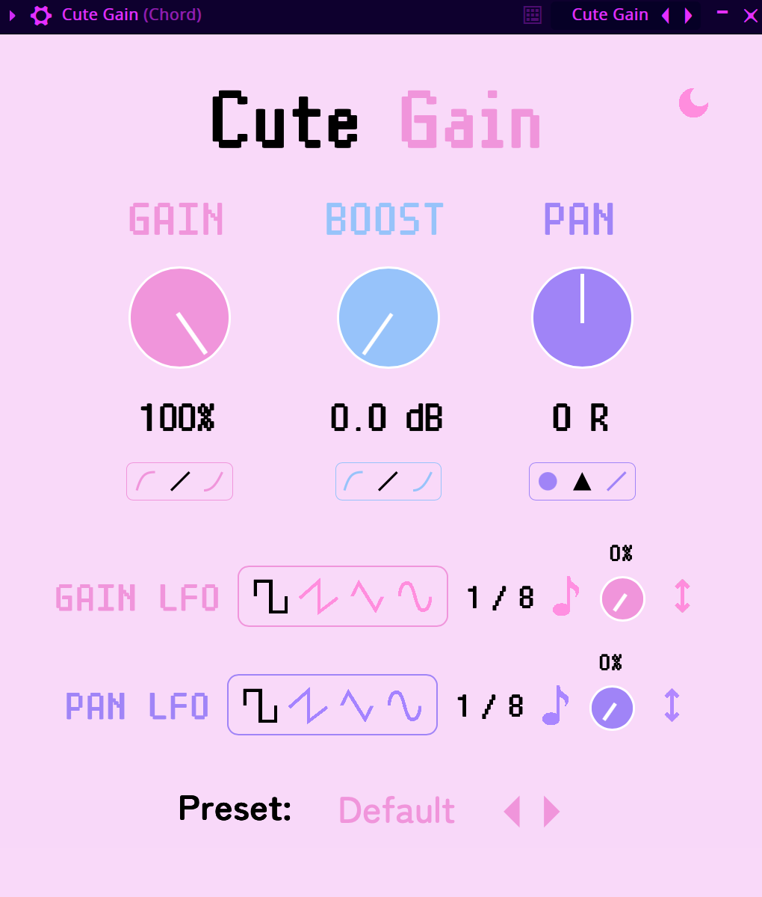

# Cute Gain

Cute Gain is a VST/AU plugin for gain control and panning.

### Controls:
- Gain - the knob controls the volume from 0% to 100%.
- Gain curve - you can choose a logarithmic, linear, or exponential curve for the gain knob.
- Boost - with the boost knob, you can increase the original volume by up to 12 dB.
- Boost curve - you can choose a logarithmic, linear, or exponential curve for the boost knob.
- Pan - this controls the volume of the left and right channels individually for a stereo effect.
- Panning Law - changes the panning law algorithm between constant power, triangular, and linear.
- Gain LFO Waveform - pick from square, sawtooth, triangle, and sine shapes for the gain LFO. 
- Gain LFO Rate - the speed of the gain LFO in bpm synced times.
- Gain LFO Amount - the amount of the gain LFO effect applied.
- Gain LFO Invert - inverts the phase of the gain LFO.
- Pan LFO Waveform - pick from square, sawtooth, triangle, and sine shapes for the panning LFO. 
- Pan LFO Rate - the speed of the panning LFO in bpm synced times.
- Pan LFO Amount - the amount of the panning LFO effect applied.
- Pan LFO Invert - inverts the phase of the pan LFO.

### Design

Our design is available here: https://www.figma.com/design/B2ZkSdjkJbhSAynBWiNesK/Cute-Gain

### Purchase

### See Also

- [Cute Pitch](https://github.com/Moebytes/Cute-Pitch)
- [Cute Crush](https://github.com/Moebytes/Cute-Crush)